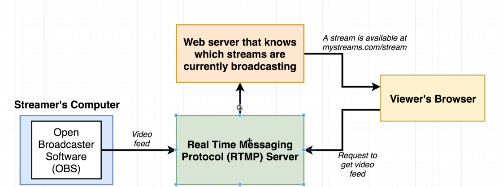

   

# Video Streaming Portal

Video Streaming Portal with the possibility to stream video on your channel.

**Features**:

- Login  (OAuth 2.0 to Access Google APIs).
- Create a channel
- Stream on the channel 
- Delete the channel
- Edit the channel

## Architecture

## Demo video

    

## How to start

### Deploy (optional)

Actually, in this repository there is my client_id from the Google APIs, due to future limitations that I am not aware of, is suggested to change my client_id with your, for more info visit: https://developers.google.com/identity/protocols/oauth2.

Once you have, change the value of the variable's name 'clientId' in the file: ./client/src/components/GoogleAuth.js.

### Install

Starting from the root directory type in the terminal: 

1. `cd api`
2. `npm install`
3. `npm run start`
4. `cd ..`
5. `cd rtmpserver`
6. `npm install`
7. `npm run start`
8. `cd ..`
9. `cd client`
10. `npm install`
11. `npm run start`

### Publishing live stream (Example with OBS)

1. > Settings -> Stream

   1. Stream Type : Custom Streaming Server.

   2. URL : rtmp://localhost/live/{ID OF THE CHANNEL THAT YOU CREATE IN THE APP}.

   3. Stream key : ID OF THE CHANNEL THAT YOU CREATE IN THE APP.

## Credits

The baseline of the project is coming from a course that I attended on Udemy, more info: https://www.udemy.com/course/react-redux/

